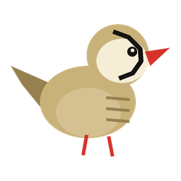
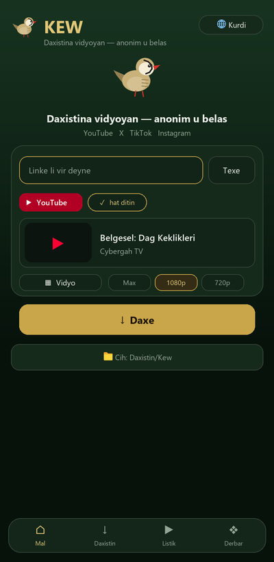
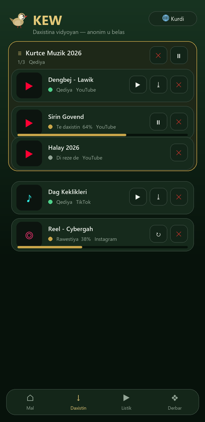
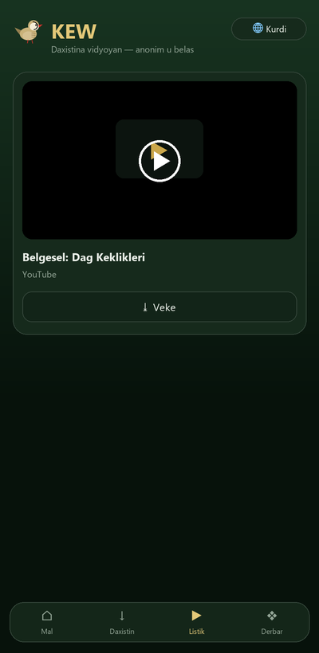
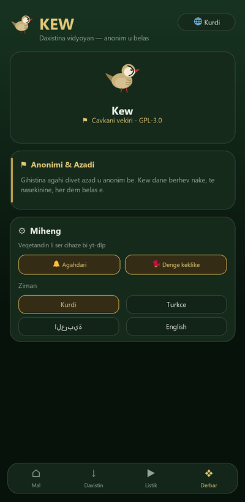

<p align="center">
  
</p>

<h1 align="center">🦃 KEW — ji bo Windows</h1>

<p align="center">
  <b>Daxistina vîdyoyan a anonîm û belaş — guhertoya sermaseyê (Windows)</b><br>
  YouTube · X · TikTok · Instagram
</p>

<p align="center">
  
  
  
  
  
</p>

<p align="center">
  <i>Ji aliyê <b>Cybergah Group</b> ve · <a href="https://cybergah.com">cybergah.com</a></i>
</p>

---

## 📖 Kew çi ye?

**Kew** (bi kurmancî navê teyrê çiya — *keklîk*) sepaneke **çavkanî-vekirî**, **anonîm** û bi temamî
**belaş** e ji bo daxistina vîdyoyan. Ev repo **guhertoya Windowsê** ye — heman navrûya React a
guhertoya Androidê, lê li ser sermaseyê bi **Electron** dimeşe.

Veqetandin û daxistin li ser komputerê bi **`yt-dlp.exe` + `ffmpeg.exe`** tê kirin — **bê pêşkêşkar,
bê şopandin, bê reklam**. Dosyên daxistî rasterast diçin peldanka **`Downloads\Kew`**.

---

## ✨ Taybetmendî (wek Androidê)

- 🔗 Lînkê têxe û daxe — YouTube, X, TikTok, Instagram
- 🎬 Lîsteyên YouTube (playlist) — her vîdyo serbixwe; kontrola giştî (rawestîne / bidomîne / betal)
- 🎵 Vîdyo an tenê deng (MP3), hilbijartina kalîteyê (Max/1080/720/480)
- 💾 Tomarkirin li `Downloads\Kew`; lîstikvanê hundirîn + vekirin bi lîstikvanê pergalê
- 🔁 Ceribandina otomatîk a ji nû ve (vîdyoya ku danabe nayê derbaskirin)
- 🔔 Dema xilas dibe: agahdarî + dengê keklîkê
- 🌍 5 ziman (kurdî, tirkî, erebî, îngilîzî, farisî) + piştgiriya RTL + anîmasyona destpêkê

---

## 📱 Wêneyên ekranê

| Mal | Daxistin | Lîstik | Mîheng |
|:---:|:---:|:---:|:---:|
|  |  |  |  |

---

## 🏗️ Avahî

```
┌──────────────────────────────────────┐
│  Renderer:  React + TypeScript + Vite        │  ← navrû (bi Androidê re hevpar)
├──────────────────────────────────────┤
│  Electron main (electron/main.cjs)           │  ← pencere + IPC
│     └─ spawn yt-dlp.exe / ffmpeg.exe         │  ← veqetandin/daxistin li ser cîhazê
│  preload.cjs  →  window.kew                  │  ← pira ewle (contextBridge)
└──────────────────────────────────────┘
```

| Tişt | Teknolojî |
|---|---|
| Navrû | React 18, TypeScript, Vite 5 |
| Sermase | Electron 31 |
| Daxistin | yt-dlp.exe + ffmpeg.exe |
| Sazker | NSIS (`installer.nsi`) |
| Lîsans | GPL-3.0-or-later |

---

## 📂 Avahiya projeyê

```
KEW-WINDOWS/
├─ electron/
│  ├─ main.cjs        # pêvajoya sereke: pencere + IPC (yt-dlp/ffmpeg)
│  └─ preload.cjs     # pira ewle (window.kew)
├─ src/               # navrûya React (bi Androidê re hevpar)
│  └─ lib/native.ts   # bi Electron IPC ve girêdayî
├─ resources/
│  ├─ icon.ico        # (yt-dlp.exe û ffmpeg.exe NÎNE — binêre jêr)
├─ installer.nsi      # skrîpta sazkerê (NSIS)
├─ index.html
└─ package.json
```

> **Têbînî:** `yt-dlp.exe` û `ffmpeg.exe` ji ber mezinahiya wan **di repo de nînin**.
> Berî avakirinê wan bîne (binêre `tools/fetch-resources.ps1`).

---

## 🔨 Avakirin

Pêdivî: **Node.js 18+**.

```powershell
# 1) Pakêtan saz bike
npm install

# 2) Binarên pêwîst bîne (yt-dlp.exe + ffmpeg.exe -> resources\)
powershell -ExecutionPolicy Bypass -File tools\fetch-resources.ps1

# 3) Bimeşîne (geliştirici)
npm start          # vite build + electron .
```

### Sazkerê çêke (Kew-Setup.exe)
```powershell
# NSIS daxe (makensis.exe), paşê:
makensis installer.nsi
```
Encam: `release\Kew-Setup-1.0.0.exe` (sazkirina bê-rêvebir, kurteriyên Destpêk + Sermase).

---

## 📥 Sazkirin (bikarhêner)

- `Kew-Setup-1.0.0.exe` veke → cih hilbijêre → saz bike.
- An jî guhertoya **portable** (`release\Kew-win\Kew.exe`) bê sazkirin bimeşîne.
- Dosyên daxistî: `C:\Users\<navê te>\Downloads\Kew`

---

## ⚑ Nepenîtî û Azadî

> Kew tu daneyên kesane berhev nake, tu çavdêriyê nake û her dem belaş e.
> Veqetandin li ser cîhaza te dibe — tu pêşkêşkar, tu aliyê sêyemîn.
> **Em ji bo înternetek azad û anonîm dixebitin.** — *Cybergah Group*

---

## 📜 Lîsans

**GPL-3.0-or-later** — Nermalava azad. Bi kar bîne, vekole, parve bike, baştir bike.

---

<p align="center">
  <br>
  <b>Cybergah Group</b> · <a href="https://cybergah.com">cybergah.com</a> · info@cybergah.com<br>
  <sub>Kew v1.0.0 · © 2026 · Çavkanî vekirî / Open source · GPL-3.0</sub><br>
  <sub><i>Azad wek çûk. 🕊️</i></sub>
</p>
